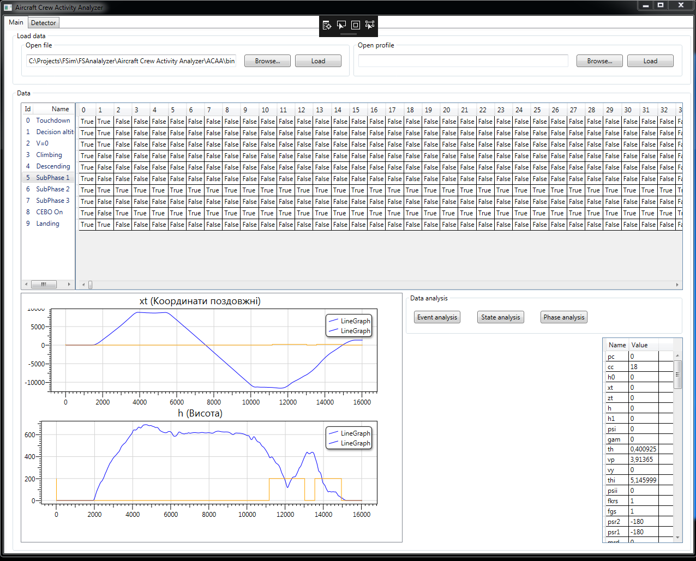
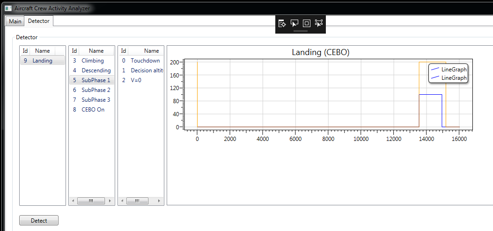

# Flight analyser
It is experimental project for research the metods of analysis the crew activity based on flight simulator trianing data using the situated-oriented approach. The application allows to upload the raw flight data and executes the consequence analysis of flight situations. This software is not ready-to-use product!

Raw data and graphics:

Detection tab:

